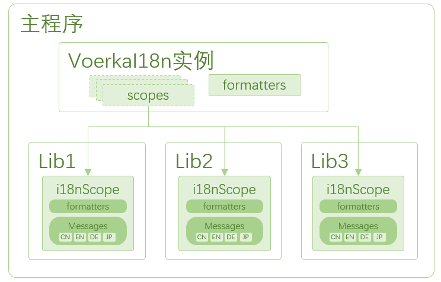

# 多库联动

> 本文档介绍如何在多个库之间实现联动和协作

`voerkai18n `支持多个库国际化的联动和协作，即**当主程序切换语言时，所有引用依赖库也会跟随主程序进行语言切换**，整个切换过程对所有库开发都是透明的。
库开发者不需要特殊配置，只需要像普通应用一样进行开发即可。
## 基本原理

整体原理框架如下：



当我们在开发一个应用或者库并`import "./languages"`时，在`langauges/index.js`进行了如下处理：

- 创建一个`i18nScope`作用域实例
- 检测当前应用环境下是否具有全局单例`VoerkaI18n`
  - 如果存在`VoerkaI18n`全局单例，则会将当前`i18nScope`实例注册到`VoerkaI18n.scopes`中
  - 如果不存在`VoerkaI18n`全局单例，则使用当前`i18nScope`实例的参数来创建一个`VoerkaI18n`全局单例。
- 在每个应用与库中均可以使用`import  { t } from ".langauges`导入本工程的`t`翻译函数，该`t`翻译函数被绑定当前`i18nScope`作用域实例，因此翻译时就只会使用到本工程的文本。这样就割离了不同工程和库之间的翻译。
- 由于所有引用的`i18nScope`均注册到了全局单例`VoerkaI18n`，当切换语言时，`VoerkaI18n`会刷新切换所有注册的`i18nScope`，这样就实现了各个`i18nScope`即独立，又可以联动语言切换。

## 使用方法

在开发库与普通应用时使用`VoerkaI18n`的使用方法是一样的,唯一的区别在于：

在`lanuages/index.(js|ts)`中需要指定`library`参数

```javascript

const scope = new VoerkaI18nScope({    
    // ...
    library     : false,                      // 开发库时设为true
    // ...
}) 
```

- 当开发库应用时，需要将`library`参数设为`true`,应用则设为`false`或者不设置。


## 常见问题

### 如何在库中使用`t`翻译函数?

在开发库与普通应用时使用`VoerkaI18n`的使用方法是完全一样的。

### 切换应用时是否所有库均会自动切换语言?

是否，每一个库均具有一个对应的`i18nScope`实例，并且该实例会注册到全局`VoerkaI18n`实例，当调用`i18nScope.change`进行语言切换时，本质上是调用全局`VoerkaI18n`实例的`change`方法，该方法会通知所有注册的`i18nScope`实例进行语言切换。


### 使用不同的版本VoerkaI18n开发库是否有问题?

假设`lib1`使用`VoerkaI18n 2.0`开发，`lib2`使用`VoerkaI18n 2.1`开发，`lib3`使用`VoerkaI18n 2.2`开发，
而主应用基于`VoerkaI18n 2.3`开发，那么是否会有问题？

没有任何问题，可以完美配合工作。你唯一需要做的是：

> 将`lib1`、`lib2`、`lib3`的`VoerkaI18n runtime`版本依赖指定为`peerDependencies`即可。

这样当主应用安装`VoerkaI18n runtime 2.3`，`lib1`、`lib2`、`lib3`也指向同一个版本，并且其内部的`i18nScope`也会自动注册到全局`VoerkaI18n`中，所以配合工作不会有任何问题。


### 多库场景下的语言配置以谁为准？

原则上，一个应用中只能有一个指定`library=false`的`i18nScope`，整个应用的语言配置就以主应用为准。

如果一个应用中存在多个`library=false`的`i18nScope`，则以最后一个`library=false`的`i18nScope`为准。


 


